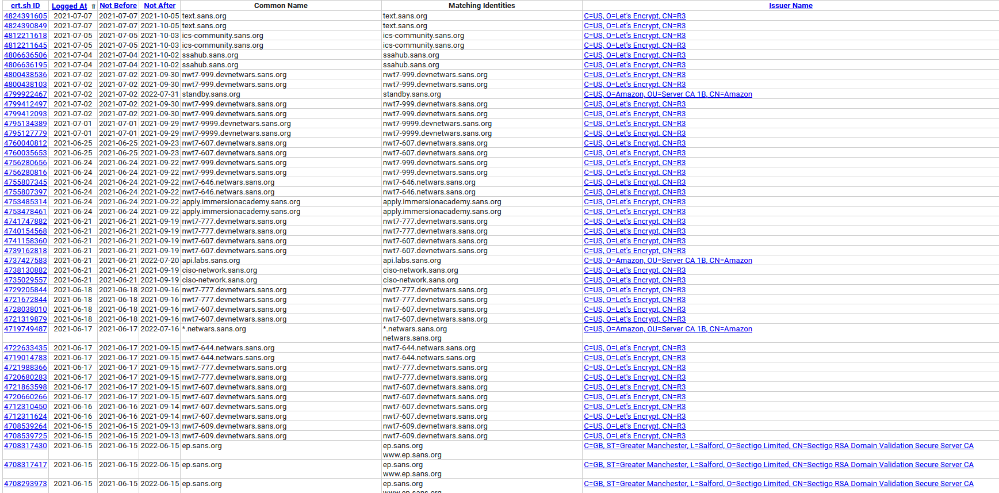
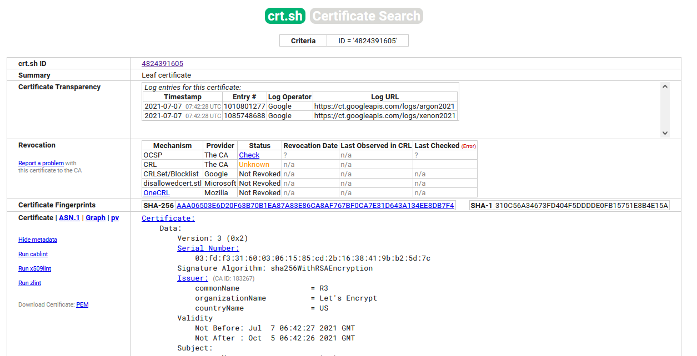
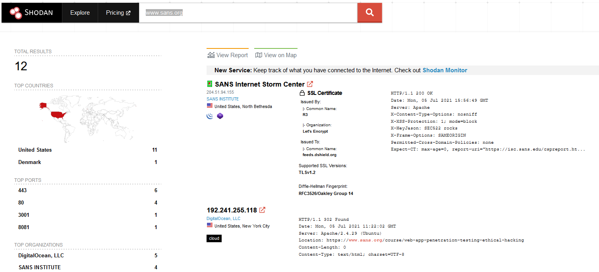
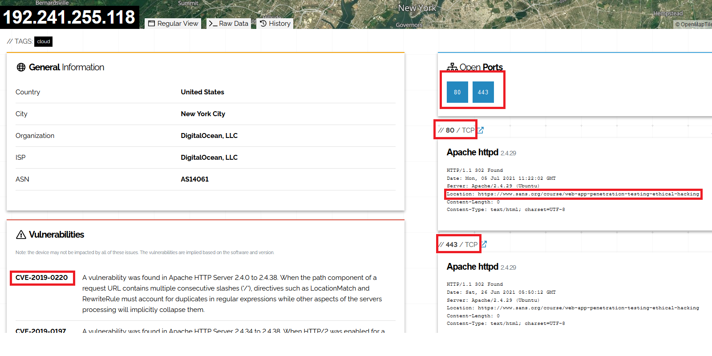
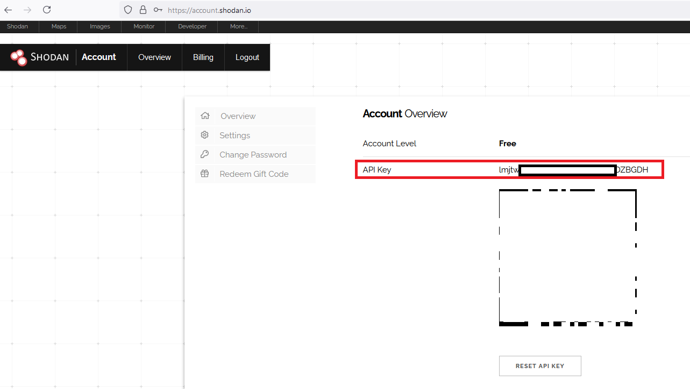
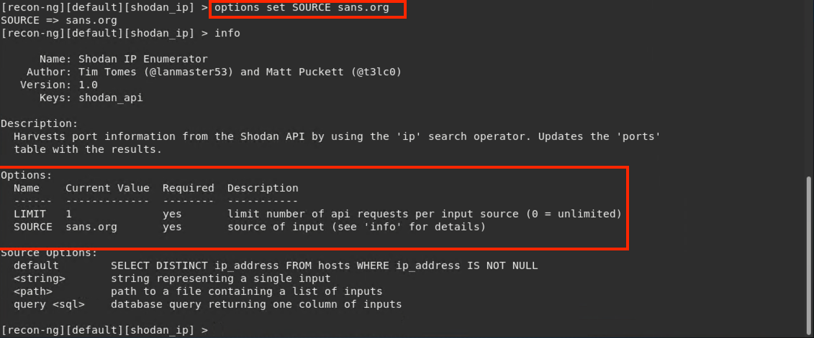
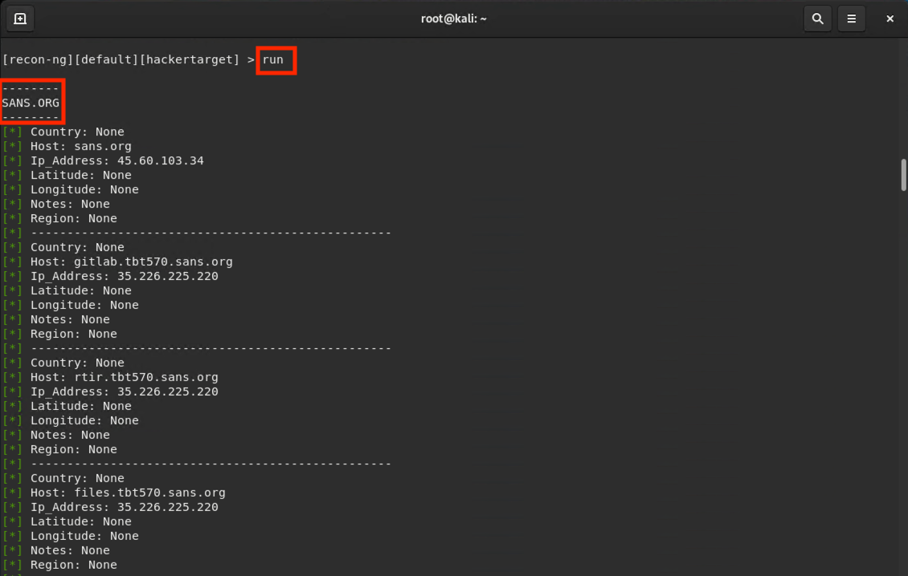

##  16.1 Lesson Plan: Introduction to Pen Testing and OSINT

### Overview

In today's class, we'll introduce students to pen testing and its value to an organization's security. We will discuss pen testing career pathways and then explore the first phase of pen testing using open source intelligence (OSINT) tools.

### Class Objectives

By the end of class, students will be able to:

- Understand the role of a pentester in assessing a business's security. 
- Collect domain information by using OSINT techniques and tools like Google dorking, Shodan, and certificate transparency.
- Use Shodan and Recon-ng to discover domain server information. 

### Instructor Notes

- Today, students will learn about pen testing and the steps involved in becoming a pentester, and then they'll perform some basic reconnaissance using OSINT tools.
- Provide enough time for students who have some difficulty understanding the syntax of a tool or how it works.
- We'll start off with mostly lectures introducing the theory of pen testing, but there are many opportunities for questions along the way.
- Remind students to keep their findings from each activity, because they will use them when they create penetration test reports on the fourth day of this module.
- Before class starts today, go to https://shodan.io and register for a free account. Once registered, click **Account**. You will need to log into this website for one of today's demonstrations. 

    

### Lab Environment

For this module, you will use the Pentesting lab environment located in Windows Azure Lab Services. RDP into the Windows RDP Host machine using the following credentials:

  - Username: `azadmin`
  - Password: `p4ssw0rd*`

The credentials to the Hyper-V VMs are as followed:

| Virtual Machine | Username | Password |
|-----------------|----------|----------|
| Kali            |root|kali|
| Metasploitable2 |msfadmin|cybersecurity|
| Windows 10 |.\Administrator|Topsecret!|
| WINDC01 | Administrator|Topsecret!

### Slideshow

The lesson slides are available on Google Drive here: [16.1 Slides](https://docs.google.com/presentation/d/1BuiM4MgbggD9qWxRj88VRduzj7jhDY_OgjfExQ-bUX8).

- To add slides to the student-facing repository, download the slides as a PDF by navigating to **File** > **Download** and choosing **PDF document**. Then, add the PDF file to your class repository along with any other necessary files.

- **Note**: Editing access is not available for this document. If you or your students wish to modify the slides, please create a copy by navigating to **File** > **Make a copy**.

### Time Tracker

The time tracker is available on Google Drive here: [16.1 Time Tracker](https://docs.google.com/spreadsheets/d/1JyGml25Ob-iu4NQHXV8X8KgMZAHHyOupf1UsRVsFQ-g/edit#gid=0)

### Student Guide

Share the student-facing version of this lesson plan after class: [16.1 Student Guide](studentguide.md).

-------

### 01. Instructor Do: Introduction to Penetration Testing (0:20)

Welcome the students to class, and begin by explaining that we have covered a wide range of cyber attacks and vulnerabilities in this class so far. Now, we will look at a specific professional role that partners with organizations to assess their security postures, vulnerabilities, and susceptibility to attacks, called **penetration testing**.

Today we will cover the following: 

- An introduction to penetration testing and its business goals.
- A high-level overview of the various stages of a pentest engagement.
- A deep dive into the first step of a penetration test: **planning and reconnaissance**.

| :warning: **Important!** :warning:|
|:-:|
| Before we begin, emphasize that the techniques we will learn in this module can be used to break into networks and do serious damage to an organization's infrastructure. 
This is illegal when done without permission. Students should understand that the tools and techniques discussed today are serious, and misusing them can have serious consequences.
Caution students that they should never practice these techniques against computers that they do not own or do not have clear written permission to interact with.|

#### What Is Penetration Testing?

Explain that while network administrators and security personnel do their best to harden their networks, it often takes an external entity to identify misconfigurations and subtle security holes.

- Penetration testing, often referred to as **pen testing** or **ethical hacking**, is the offensive security practice of attacking a network using the same techniques that a malicious hacker would use, in an effort to identify security holes and raise awareness within an organization. 

Continue to review pen testing by covering the following:
  - Organizations hire pentesters to assess their security controls. Pentesters find flaws in those controls, help the organization understand their flaws, and provide recommendations about which vulnerabilities to prioritize and how to fix them.
  - Pentests are often administered by consultancies, which can take an "outside" view of a client's networks.
  - In the simplest terms, pentesters aim to break into a client's machine, infrastructure, or even physical premises in order to help the client improve their security.
  - A penetration test is often referred to as an **engagement** by practitioners.
  - Pentesters, unlike malicious hackers, do this only after receiving permission from the security owner to begin an engagement.  
  - Penetration testers use a combination of automated tools and manual tools to research vulnerabilities, craft phishing emails, manually exploit hosts, and write shell code. Pentesters use these tools creatively, just as malicious hackers do.
  

#### Module Overview and Penetration Testing Phases

Explain that in this week's activities, students will play the role of consultants at **GoodCorp** who have been hired to conduct a penetration test against **MegaCorpOne**.
- MegaCorpOne is an organization that specializes in disruptive innovation in the nanotechnology industry and has hired GoodCorp to run a penetration test.
- Students will be tasked with going through the penetration testing engagement to asses MegaCorpOne's security.
- They will conclude their test with a report of their findings, so students should be sure to keep all of their findings as they proceed through the penetration testing activities.

Penetration testers follow a methodology during an engagement that is designed to mimic that of an actual attack. This helps network defenders understand how effective their organization's defenses are.

Explain that an engagement consists of the following five phases, and provide a high-level overview of each:

1. **Planning and Reconnaissance** - This first phase consists of two parts:
   - A. **Planning** - During this pre-engagement step, the purpose and scope of the test is defined and all legal contracts are signed.
   - B.  **Reconnaissance** - This step consists of obtaining publicly available information about your target.
3. **Scanning** - This phase consists of using tools such as nmap & zenmap to run a **port scan** against your target to gather information, such as open ports, and running services to determine potential vulnerabilities.
4. **Exploitation** - This phase consists of attacking the vulnerabilities discovered in the previous steps in order to gain access to the target.
5. **Post Exploitation** - After accessing the target, this phase consists of gathering valuable information from the compromised systems.
6. **Reporting** - This final phase consists of reporting on the previous five steps to provide a summary of actions taken, findings, and recommended mitigations.

Tell students that during the four classes in this module, we will proceed through these five phases as we conduct a penetration test against **MegaCorpOne**.
- Day 1 (today): Planning and Reconnaissance phase
- Day 2: Scanning phase  
- Day 3: Exploitation and Post Exploitation phases
- Day 4: Reporting phase  

Emphasize that students must keep their findings from each activity in this module, because they will use them on the fourth day to create their penetration test report.

Explain that while so far we've discussed these phases sequentially, as in a real attack, there are times when steps are skipped or repeated and when their order is switched. For example:
  -  In a real attack, an attacker may attempt to directly exploit a system.  Once they have penetrated the system, an attacker might conduct reconnaissance and scanning to gain further information to access more resources. This process might be repeated in any order to gain even more access.
  -  In some types of penetration test, the client may provide the pentester with network diagrams and system access. In that case, the recon, scanning, and exploitation phases could potentially be skipped as the pentester would already have access to their targets.
  - Penetration testers may vary the sequence of these phases from one engagement to the next, depending on the client and situation. Point out that in this module, students will experience some exceptions to the typical sequence of the phases.

Answer any questions before proceeding to the first phase.

### 02. Instructor Do: Planning the Penetration Test (0:20)

Begin by explaining that before a penetration test starts, it must be planned. This is part of the Planning and Reconnaissance phase.
 - This step is an interaction between the organization and the pen testing team. 
 - It helps the pentesters thoroughly understand the client's needs before beginning the test.
 
Explain that most businesses' primary interest is not how attackers might gain access to their networks. 
  - Instead, they are concerned with the major consequences that an exploited vulnerability may have on their reputation, operations, or bottom line.

The first form of contact during planning is usually a kick-off call or meeting, during which clients work with pentesters to determine the purpose and scope of the project:
- **Purpose** is defined by clarifying the business's needs and concerns and communicating which assets the business is most interested in protecting. 
- **Scope** is defined by informing pentesters which machines and networks are off limits and should not be targeted for attack. 
    - Some production systems may be off limits due to a fear of downtime if the system becomes compromised. Unlike actual malicious hackers, pentesters often have rules they have to follow.
    - Penetration tests also typically have a defined time limit in which to conduct the testing. Somewhere between a few days and a few weeks is common. The client may even specify particular times of day.
    - Often, only a few executives or security personnel at the client organization know about an ongoing engagement. 
       - Because of this, pentesters often carry a "get out of jail" card or a document with them in the case they are identified as an attacker. They can show the document to prove that they were hired by a staff member.

The pen testing team will scope their test accordingly, seeking to:
  - Demonstrate potential business impact due to vulnerabilities in the network.
  - Provide recommendations for mitigating those vulnerabilities in the future.

Conclude by explaining that the primary deliverable from this stage is a document summarizing the engagement's purpose and scope, as well as associated details such as timeframe and emergency contacts. 

Finally, mention that the scope will also specify the type of penetration test that will be run.

#### Types of Penetration Testing

Explain that there are three primary types of penetration tests: **no view**, **full view**, and **partial view**. 

- In **no view** testing, also known as **black box** testing, the pentester simulates a malicious hacker who has no prior knowledge of the target system and network. The pentester is paid to learn and exploit as much as they can about the network using only the tools publicly available to an attacker on the internet.
   - For example, they may only know the company name and be forced to find various key resources, like IP ranges and access credentials. 
- In **full view** testing, also known as **white box** testing, the pentester is given full knowledge of the system or network. This knowledge allows them to tear apart subtle security issues on behalf of their clients. Full view pen testing is most appropriate when the client wants a detailed analysis of all potential security flaws, rather than exposed and visible vulnerabilities.
   - Full view testers are given network diagrams, access credentials to the networks, system names, usernames, emails, and phone numbers.
- **Partial view** testing, also known as **gray box** testing, involves providing partial knowledge of the target to the testers.  These types of engagements are often performed by the in-house system or network administrator. 

While every pentest can be categorized as either full view, no view, or partial view, there are other subtle differences between engagements. For example, the extent to which the organization's employees know about the engagement, and how much the pentester knows about the company. 

Regardless of the scenario, the main deliverable for any pentester is a report that summarizes their findings and recommendations for improvements.

#### Statements of Work & Legal Indemnification

Explain to students that before beginning a security assessment, there are also several legal steps that need to be accomplished before the actual work can begin.
  - Since penetration testing is hacking, there must be consent from the entity being hacked.
  - To protect the assessors from legal ramifications, a **statement of work (SoW)** must be agreed upon and signed by both parties.
     - A SoW outlines the scope of the test, the timeline, the points of contact, and how the test will be conducted.

⚠️ **Important**: Remind students that penetration testing without a contractual agreement is ***illegal*** unless it is conducted on your own network or on devices that you own. 

Verbal consent is very hard, nearly impossible, to prove in court. If a friend asks you to pentest their network without a SoW and then sues you, they can prove that you attacked their network but you cannot prove that they verbally agreed to it.

Review the following examples of legal and illegal penetration testing assessments:

  - **Legal**: A financial institution asks you to perform a penetration test on their private network. They will give you access to all the credentials and architecture diagrams that you may need. You will also meet with them beforehand to sign a contract clearly illustrating the scope and purpose of the test.
     - This is a legal full-view penetration test, because you have signed a contract before you begin your assessment.

- **Illegal**: A friend asks you to perform a penetration test on a social media website that they just joined, as they want to make sure their information is safe.
     - This is an illegal no-view test, because neither the friend nor you own the social media website network or devices, and the social media website has not granted permission or signed a contract authorizing this test.

#### Summary

Summarize the concepts covered in this class:
- **Penetration testing**, often referred to as **pen testing** or **ethical hacking**, is the offensive security practice of attacking a network using the same techniques that a malicious hacker would use, in an effort to identify security holes and raise awareness within an organization. 
- The five phases of a pen testing engagement are: **Planning and Reconnaissance**, **Scanning**, **Exploitation**, **Post Exploitation**, and **Reporting**. 
- During the planning phase, the engagement's scope and purpose are defined.
   - The **purpose** is defined by clarifying which assets the business is most interested in protecting. 
   - The **scope** is defined by clarifying which machines and networks are off limits during the "attack." 
      - The scope also includes the type of penetration test that will be run. Types include: **no view**, **full view**, and **partial view**. 
- A **SoW (statement of work)** is also completed during the planning phase. It outlines the scope of the test, the timeline, the points of contact, and how the test will be conducted.

In the first activity, we will role play a penetration tester who has been given a number of contracts and has to determine what type of pentest each involves and whether it's legal.

Answer any questions that remain before proceeding to the first activity.
 
### 03. Student Do: Types of Penetration Testing (0:15)

Explain the following to students:

- In this activity, you will work as a security consultant at GoodCorp who's been hired to perform penetration tests.
- You have just been given a list of potential contract opportunities. 
- Your first task it to evaluate the list and determine: 
  - (1) Whether the assessment is legal or illegal
  - (2) The type of penetration test being requested 

Send students the following files:

- [Activity File: Types of Penetration Testing](Activities/01_Types_of_Pentesting/Unsolved/README.md)

Answer any questions before students start the activity.

### 04. Instructor Review: Types of Penetration Testing  (0:05)

The goal of this activity was for students to distinguish between legal and illegal penetration tests, while also identifying the type of test. 

- Emphasize that it's extremely important to understand the legality around penetration testing, as it is literally hacking. 
  - If hacking is not sanctioned by the people being hacked, it is illegal.

Send students the following solution guide, and use it to review the activity:

- [Solution Guide: Types of Penetration Testing](Activities/01_Types_of_Pentesting/Solved/README.md)

### 05. Instructor Do: Intro to MITRE ATT&CK (0:15)

Explain that penetration testing is a methodical process and that the type of assessment will determine where the pentester begins. 

A company called **MITRE** developed the **MITRE ATT&CK matrix** to provide a visual representation of all the different **techniques, tactics, and procedures (TTPs)** that may be performed throughout an assessment.

- We will use this matrix as a reference for the TTPs that we will conduct throughout the next two weeks of class. 

- Note that not every tactic or technique listed in the matrix will actually be used in any single engagement. 

Show students the following website: https://attack.mitre.org/matrices/enterprise/.

Point out and explain the following on the site:

- Each **header** represents a tactic. For example, the first tactic listed is **reconnaissance**. It's listed first because attackers conduct reconnaissance on a target before actually performing any exploitation. 
- Each **row** under the header is a technique. For each tactic, there are multiple techniques. For example, during reconnaissance, an attacker may use **active scanning** to gather information about a target, or they may **search open technical databases** to gather similar information. 
   - The appropriate techniques to use depend on what you're trying to accomplish. Active scanning, for example, is great for gathering a list of open ports but not for gathering credentials. Phishing would be the opposite. 

Point out to students that MITRE ATT&CK isn't so much a ruleset as it is a "hacker's playbook." The matrix is comprehensive, meaning that virtually every potential attack falls under a tactic and maps to a specific technique. As a penetration tester, it's beneficial to be able to map out what techniques you performed in an assessment so that the customer can learn specifically what TTPs were successful and what needs to be addressed. 

- Explain to students that this week's module will follow the MITRE ATT&CK matrix tactics from left to right. We won't teach every tactic due to time constraints, but we'll begin by learning about reconnaissance today.

Finally, emphasize that MITRE is a powerful matrix, and students should follow and reference it, for several reasons:
- It is comprehensive and includes almost every possible tactic or technique that an attacker could perform during a hack.
- During the reporting process, it's important to reference specific tactics and techniques that an attacker would use. This matrix helps provide a way of abstracting technical topics for less-technical staff.
- It helps create a more comprehensive report by categorizing specific security deficiencies. E.g., If a red team successfully demonstrates several techniques under the **lateral movement** tactic, it highlights that tactic as a security hole in the organization. 

Inform students that we will incorporate MITRE into our reporting activities on Day 4. 

### 06. Instructor Do: Reconnaissance with OSINT and Google Dorking (0:20)

Explain that in this section, we will cover the next part of a penetration test, reconnaissance, which is also part of the Planning and Reconnaissance phase.
  - Point out that reconnaissance is also the first MITRE ATT&CK Tactic. 

Define **reconnaissance**, or **recon**, as gathering information about your target.  

- Reconnaissance is divided into two types: passive and active.
   - **Passive recon** often refers to **open source intelligence (OSINT)**, which leverages information about the target that is publicly available on the internet. This includes all domains and hosts belonging to a target that are publicly viewable. 
   - **Active recon** also refers to gathering information about the target, but active reconnaissance involves directly interacting with the target.
- Additionally, point out that reconnaissance can be conducted externally (**external reconnaissance**) from the target or internally (**internal reconnaissance**) after accessing the target.

The first technique that we will learn within the passive reconnaissance tactic leverages Google, which is also known as Google dorking. 

#### Google Dorking 

Explain to students that sometimes we're able to identify useful information on the public internet using search engines. 

**Google dorking** enables us to manipulate Google searches to narrow down our queries in order to acquire actionable intel. 

- For example, with a Google search, we could potentially identify email addresses associated with our target. The email addresses could then be used for future phishing campaigns or even for a brute force attack where we guess a password with the email address on a login page. 

- Sometimes, companies accidentally leave sensitive information on the public internet, allowing it to be found through a search engine. 

   - For example: [Vice News: ISP Left Corporate Passwords and Keys Exposed](https://www.vice.com/en/article/zm9dmj/an-isp-left-corporate-passwords-keys-and-all-its-data-exposed-on-the-internet).

Point out to students that Google dorking falls under the technique **Search Open Websites/Domains: Search Engines**, **ID T1593-002**: https://attack.mitre.org/techniques/T1593/002/.
	
Inform students that Google-Dorking will eventually cause Google to ask if you are human and make you solve a CAPTCHA challenge. This is to prevent automated tools from performing Google-Dorking.

Next, we will demonstrate some simple Google dorking techniques. 

#### Google Dorking Demonstration

In this demonstration, we will show the basic functionality of Google dorking. Students will then apply this tool to gather OSINT in the next activity. 

1. In a browser, navigate to www.google.com. 

2. In the search bar, enter "site:sans.org".

    - Explain that this search will filter results to only show links belonging to sans.org.

3. Next, in the search bar, add to the existing search "type:pdf", so the search is now "site:sans.org type:pdf".

    - This search will filter all results to show only PDF documents from the sans.org website. 

4. Replace "type:pdf" with "intext:password", so the search is now "site:sans.org intext:password".

    - This will show any webpage with "password" on the page. This is especially useful for searching for passwords. 

Provide the following additional resources for students to reference:

- [Cybrary: Google Dorking Commands](https://www.cybrary.it/blog/0p3n/advanced-google-dorking-commands/)
- [SANS.org: Google Cheat Sheet](https://www.sans.org/security-resources/GoogleCheatSheet.pdf)

**Summary**

Summarize the concepts covered in the previous sections and demonstration:
- **Reconnaissance**, which is part of the **Planning and Reconnaissance** phase, means gathering information about your target.  
- **Passive recon** often refers to **open source intelligence (OSINT)**, which leverages information about the target that is publicly available on the internet. This includes all domains and hosts belonging to a target that are publicly viewable. 
- **Active recon** refers to directly interacting with the target to obtain information. 
- Reconnaissance can be conducted externally (**external reconnaissance**) from the target or internally (**internal reconnaissance**) after accessing the target.
- **Google dorking** is a reconnaissance tactic that enables us to manipulate Google searches to narrow down our queries in order to acquire actionable intel. 

In the next activity, we will continue to play the role of a penetration tester and conduct a reconnaissance tactic by utilizing Google dorking to find information for a fictional organization.

Answer any questions that remain before proceeding to the next activity.

### 07. Student Do: Google Dorking Activity (0:15)

Explain the following to students:

- As a penetration tester for GoodCorp, you have been tasked with conducting an engagement against the fictional company MegaCorpOne. 
- Now that you've accepted a contract as a penetration tester and have signed all the legal documentation, you will begin OSINT.
- You will start by using Google dorking to find information pertaining to MegaCorpOne. 
- Specifically, you will search for usernames, emails, and hidden files.

Send students the following file:

- [Activity File: Google Dorking](Activities/02_Google_Dorking/Unsolved/README.md)

Answer any questions before students start the activity.

### 08. Instructor Review: Google Dorking Activity (0:10)

Explain that the goal of this activity was for students to recognize that sometimes, valuable information about a target is available on the public internet. 

- We can manipulate Google to narrow down our searches in order to gain actionable intel. 

Send students the following solution guide, and use it to review the activity:

- [Solution Guide: Google Dorking](Activities/02_Google_Dorking/Solved/README.md)

### 09. Break (0:15) 

### 10. Instructor Do: Certificate Transparency (0:10)

Begin by explaining that we will continue our reconnaissance by exploring **certificate transparency**.

Introduce certificate transparency by covering the following:
  - Certificate issuers publish logs of the SSL/TLS certificates that they issue to organizations. This is known as **certificate transparency**. 
  - Remind students that an SSL/TLS certificate is used to make an HTTP site HTTPS--that is, **secure**. 
  - This certificate transparency can be exploited by attackers and used to search for subdomains. 
  - Using certificate transparency to find subdomains of targets falls under the **Search Open Technical Databases: Digital Certificates**  MITRE technique, **ID T1596.003**. 

- Send students the following link: https://attack.mitre.org/techniques/T1596/003/.

Remind students that every technique we are performing is attributable back to MITRE. This reference can not only help provide ideas about what to do next as a penetration tester, it can also help defenders recognize what attacks are possible. 

#### Certificate Transparency Demonstration

Let's briefly demonstrate the process of finding subdomains using certificate transparency: 

1. Open a web browser and navigate to the certificate searching tool at https://crt.sh. 

      - Enter "sans.org" into the search box.

      - Contained within our search results are all the certificates associated with every variation of the example.com domain, as the following image shows:

      

2.  Clicking a certificate result reveals highly detailed information regarding the digital certificate, as the following image shows:

     

    - This information is very useful for finding subdomains of targets. For instance, in this example we can see that the certificate was issued on 07-07-2021, which means the domain that this certificate was applied to is likely still active. An expired certificate would suggest the domain is inactive.
     
Pause to answer any questions before proceeding.

### 11. Instructor Do: Shodan (0:15)

Point out to students that during reconnaissance and OSINT, we utilize several tools and techniques in order to gather information about the target. The next reconnaissance tool that we'll learn is **Shodan.io**. 

Introduce Shodan.io by covering the following:
  - **Shodan.io** is a website that conducts port scanning across the entire internet and catalogs the results for quick searching.
  - This site is useful, because it saves us the time we would spend conducting a port scan. Not having to conduct this scan also allows us to keep our originating IP address hidden.
  - Shodan is just one of several websites that conduct port scanning. These fall under the MITRE technique **Search Open Technical Databases: Scan Databases**, **ID T1596.005**.

	- Send students the following link: https://attack.mitre.org/techniques/T1596/005/.

#### Shodan Demonstration

**Note**: You will need to create a free Shodan account in order to conduct this demonstration. 

1. Navigate to Shodan.io and log in with the Shodan account that you created before class.

      - In the search bar, type "www.sans.org".

      - This search will return several findings, including SSL certs and IP addresses that have a DNS entry with "SANS" in the name, as the following image shows:

         

2.  Click the result that has the IP address 192.241.255.118.

    - This page contains a lot of useful information. Point out the open ports of the IP address and the DNS name in the "Location" field of one of the ports, as the following image shows:

      

3. Finally, explain to students that **CVE** stands for **common vulnerabilities and exposures**. Any vulnerability that is found for any OS, application, API, etc. is assigned a CVE number.

    - Shodan automatically scans for CVEs and will suggest any potential CVEs that the application is vulnerable to.

    - In this example, we can see that CVE-2019-0220 may be applicable to this site, suggesting a denial of service attack is possible. Note that just because a CVE is listed here, doesn't mean that the application is confirmed to be vulnerable. Shodan, like other vulnerability scanners, make assumptions based on versions of services.

**Summary**

Summarize the concepts covered in the previous sections and demonstrations:
- **Certificate transparency** is a reconnaissance tactic where a penetration tester can gather information from certificate issuers, which publish logs of the SSL/TLS certificates that they issue to organizations.
  - Certificate transparency can be exploited by attackers and used to search for subdomains.
- **Shodan.io** is a reconnaissance website that conducts port scanning across the entire internet and catalogs the results for quick searching.

In the next activity, students will continue to play the role of a penetration tester and conduct a reconnaissance tactic by utilizing Shodan.io to look at previous scans for MegaCorpOne.

Answer any questions that remain before proceeding to the next activity

      
### 12. Student Do: Shodan.io Activity  (0:15)

Explain the following to students:

- In this activity, you will continue to play the role of a pentester conducting an engagement on MegaCorpOne.
- You are now tasked with performing OSINT by using Shodan.io.
- You will use Shodan.io to look at previously completed port scans on several targets, without the need to use Nmap to provide you additional insight into the target.
- Additionally, you will need to create a Shodan.io account to gather information on megacorpone.com. 

Send students the following:

- [Activity File: Shodan.io](Activities/03_Shodan/Unsolved/README.md)

Answer any questions before students start the activity.

### 13. Instructor Review: Shodan.io  (0:05)

Explain that the goal of this activity was to utilize Shodan to gather data on the target instead of having to do it manually. 

Send students the following solution guide, and use it to review the activity:

- [Solution Guide: Shodan.io](Activities/03_Shodan/Solved/README.md)

### 14. Instructor Do: Recon-ng (0:15)

Recap the steps we have taken so far:
  - First, we undertook the **planning** part of the **Planning and Reconnaissance** phase by determining whether potential assessments were legal or illegal and what type of pentests were required.
  - Then, we began passive reconnaissance by using **Google dorking** to look for publicly available information.
  - After that, we used **Shodan.io** to view previously completed port scans on several targets.

Explain that now we'll continue our reconnaissance efforts with another tool called **Recon-ng**. 

Introduce Recon-ng by covering the following:
- **Recon-ng** is a web reconnaissance framework written in Python.
- Recon-ng provides a powerful, open source, web-based framework for conducting reconnaissance quickly and thoroughly. It includes the following features:
  - Independent modules
  - Database interaction
  - Built-in convenience functions
  - Interactive help
  - Command completion 

Explain that there are many scripts and programs that can assist with integrating OSINT tools into Recon-ng.
  - Recon-ng is a framework that ingests a lot of popular OSINT modules, allowing the results of multiple tools to be combined into a single report.
  - Recon-ng also went through a major update recently. The following link details changes from version 4.x to 5.x and a set of new, handy commands that comes with the newer 5.x version. [Read about the changes](https://www.blackhillsinfosec.com/wp-content/uploads/2019/11/recon-ng-5.x-cheat-sheet-Sheet1-1.pdf). 

#### Recon-ng Demonstration 

In this demonstration, we will use Recon-ng in our Kali VM. Login to kali with the credentials **root:kali**

1. In Kali, start Recon-ng:

    - Run `recon-ng`, as the following image shows:

     

    - Recon-ng doesn’t come preinstalled with modules, so you must download them as needed.
   
       - However, all the necessary modules are already installed in our VMs.
   
    - Point out that we get the error "shodan_api key not set. shodan_ip module will likely fail at runtime. See keys add." That's okay; we'll set up the key in the next step. 
   
2. We need to set an API key for modules that require it before they can be used.

    - We'll set an API key for Shodan inside Recon-ng. This allows Recon-ng to ingest Shodan results.

    - Using the account that you created for the previous Shodan demonstration, log in to Shodan and click **My Account** in the top-right corner, as the following image shows:

       
   
    - Copy the API key to your clipboard, as the following image shows. You'll use it again in Step 4. 
   
      
   
3. In Recon-ng, run `modules search` to view all of the currently installed modules.

   - For this activity, we'll use the following two modules:

     - `recon/domains-hosts/hackertarget`
     - `recon/hosts-ports/shodan_ip`
     
     The following image shows these modules:
      

4. Run `modules load recon/hosts-ports/shodan_ip` to load the `shodan_ip` scanner module.

   - Emphasize that modules need to be loaded prior to modification and use.

   - Now that the module has been loaded, we can add the API key by typing:
   
      - `keys add shodan_api [key]`
      
         - Replace `[key]` with the key that you copied to your clipboard earlier.

   - Explain that this API key allows information sharing between Shodan and Recon-ng. 

5. Run `keys list` to verify that it is imported.

6. Run `info` to get information regarding the Shodan module.

   - The `SOURCE` option is required. This option specifies which target Recon-ng will scan. This can be:

      - A list of IP addresses in a text file
      - Individual IPs
      - A domain name
   
   - For this example, we'll set the domain name sans.org as our `SOURCE` option.

       

   - Set the `SOURCE` to sans.org by typing `options set SOURCE sans.org`, as the following image shows:

      
   
   - Explain that using Shodan with a pro account allows you to query open ports on your discovered hosts without having to send packets to target systems.

7. Now, we'll use an additional module called **HackerTarget**. 

   - HackerTarget will use Shodan to query all of the hosts that belong to sans.org. 

      - **Note**: Although HackerTarget can find hosts by itself, combining modules produces better scan results by discovering additional hosts that would otherwise be missed.

   Next, we'll load the `recon/domains-hosts/hackertarget` module and change its `SOURCE` to that of the target.

   - Type `modules load recon/domains-hosts/hackertarget`.

   - This will load the `recon/domains-hosts/hackertarget` scanner module.
     
   - Now that the module is loaded, type `info` to check the `SOURCE` setting, as the following image shows:
   
      
   
   - Set the `SOURCE` to sans.org by typing `options set SOURCE sans.org`, as the following image shows:

      
   
   - The HackerTarget and Shodan modules serve two distinct purposes:

      - The HackerTarget module uses the `SOURCE` option to display scan results verbosely.

      - The Shodan module uses the `SOURCE` option to specify which target Recon-ng will scan.  
      
8. From within the `hackertarget` module, type `run`, as the following image shows:

      
      
    - Recon-ng will query Shodan for sans.org.

    - The results will automatically display verbosely in the terminal window.
      
**Summary**      
	  
Summarize this lesson with the following key takeaways:

- **Recon-ng** is a tool written in Python and used primarily for information gathering by ethical hackers, such as penetration testers.
- Recon-ng comes preloaded with numerous modules that use online search engines, plugins, and APIs, which work together to gather information against a target.
- Network defenders use information obtained from Recon-ng to formulate mitigation strategies that help defend their networks.

In the final activity, students will continue to play the role of a penetration tester and will conduct another reconnaissance tactic by utilizing Recon-ng to gather additional data on MegaCorpOne.

Answer any questions that remain before proceeding to the next activity.

### 15. Student Do: Recon-ng activity (0:15)

Explain the following to students: 

- In this activity, you will continue to play the role of a pentester conducting an engagement on MegaCorpOne. 
- You are tasked with determining whether MegaCorpOne's domain server info is accessible using OSINT tools.
- You will use the Shodan API and Recon-ng to perform your tests, and then you'll place all of your findings in a report.
 
Send students the following:

- [Activity File: Recon-ng](Activities/04_Recon-NG/Unsolved/README.md)

### 16. Instructor Review: Recon-NG activity (0:05)

Explain that the goal of this activity was to integrate OSINT technologies utilizing Recon-ng. 

Send students the following solution guide, and use it to review the activity:

- [Solution Guide: Recon-ng](Activities/04_Recon-NG/Solved/README.md)

Conclude the class by congratulating the students on completing the first phase of a penetration testing engagement: Planning and Reconnaissance!

In our next class, we will learn how to conduct the second phase, Scanning.  

-------

© 2022 Trilogy Education Services, a 2U, Inc. brand. All Rights Reserved.  
